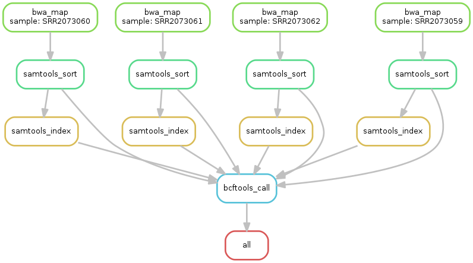

# FAST-GBS Snakemake implementation

A snakemake implementation of the FAST-GBS pipeline.

## Introduction

Fast-GBS is originally a bash pipeline facilitating the processing of FASTQ sequence files obtained using a genotyping-by-sequencing method (GBS). 
It includes a set of bash commands, python home-made scripts, and well-known bioinformatics software such as sabre, bwa, samtools, and platypus. 
Users simply fill out a parameter file and then launch the program. For each analysis, it requires the existence of a reference genome. 
This may be a relatively complete genome made of pseudochromosomes or a more preliminary draft consisting of scaffolds and contigs.



## Getting Started

These instructions will get you a copy of the project up and running on your local machine for development and testing purposes. See deployment for notes on how to deploy the project on a live system.

### Prerequisites

For this pipeline, a couple of programs are required. The following programs are needed:

```
* BWA
* Snakemake
* Python 3.x
* Samtools
```

### Installing

A step by step series of examples that tell you how to get a development env running

First we will need the required programs that were specified in [Prerequisites](#Prerequisites). And now we will create a virtual environment for our program. This can be done with the following command

```
virtualenv -p /usr/bin/python3 venv
```

After creating the venv folder we activate the environment

```
source venv/bin/activate
```

This will activate the virtual environment. After activating the virtual environment, we start with installing snakemake. This is done with the following command:

```
pip3 install snakemake
```
Well the important steps are done, the pipeline can now be run. BUT WAIT, you will need the programs used in the pipeline as well. Lets do that as well. Follow the [Built With](#built-with) list to get the programs working. I will not copy the entire how to install pages of each program in this markdown. When in trouble, feel free to contact me, but it will probably be easy when using Linux (recommended).

### How to run
For setting some parameters open the [config.yaml](config.yaml) file and change the parameters to fit your likings. And to run this pipeline you will need to execute the following command:

```
snakemake
```
Thats it, no more than that.

## Built With

* [Snakemake](https://snakemake.readthedocs.io/en/stable/) - Pipeline framework
* [BWA](http://bio-bwa.sourceforge.net/) - Mapping Algorithm
* [Samtools](http://www.htslib.org/) - Interactions with sequencing data
* [Python](https://www.python.org/) - Programming language on which snakemake is build


## Authors
* **Rick Venema** - *Snakemake Pipeline* - [RickVenema](https://github.com/RickVenema)
* **Davoud Torkamaneh**, **Jérôme Laroche**, **Maxime Bastien**, **Amina Abed**, and **François Belzile** - *Original pipeline*

## License

This project is licensed under the GNU GPL License - see the [LICENSE.md](LICENSE.md) file for details

## Acknowledgments

* This pipeline is based of [FAST-GBS](https://bitbucket.org/jerlar73/fast-gbs/overview). The [Article](https://bmcbioinformatics.biomedcentral.com/track/pdf/10.1186/s12859-016-1431-9) contains a lot more information about testing and the pipeline in general 
* This project was done for the dataprocessing course at Hanze University of Applied Sciences.

